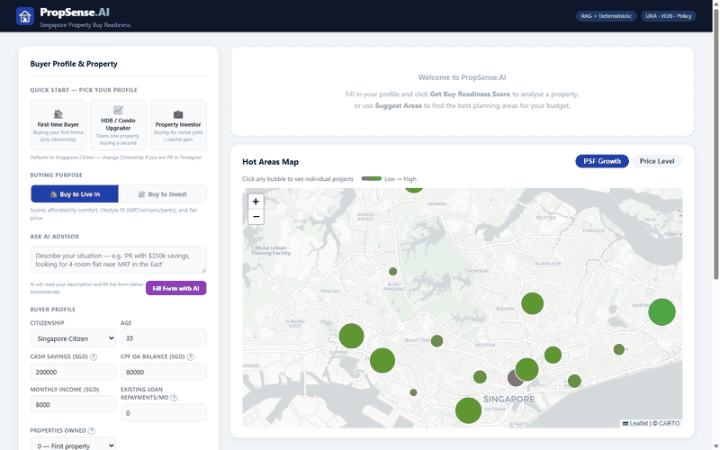
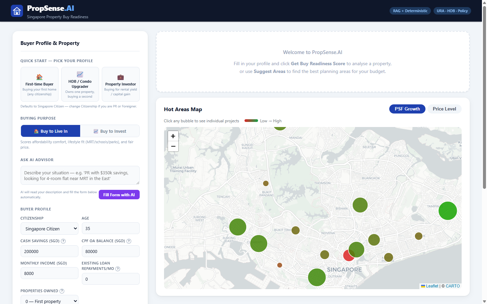
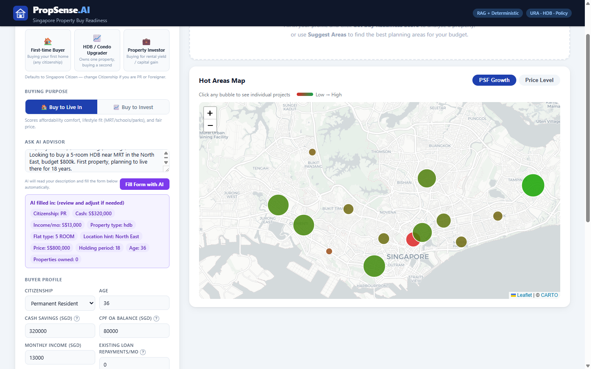
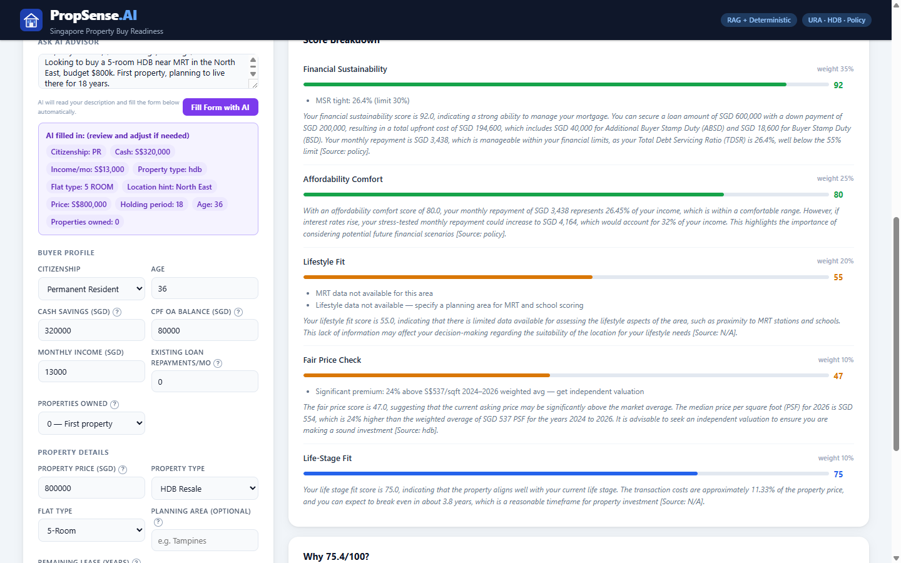
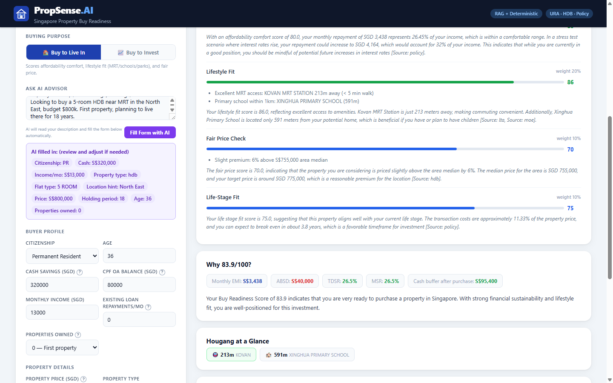
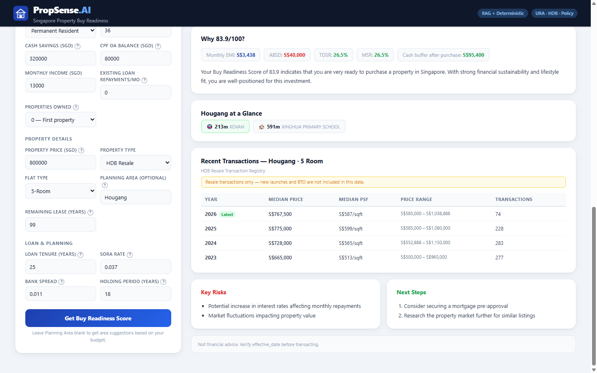
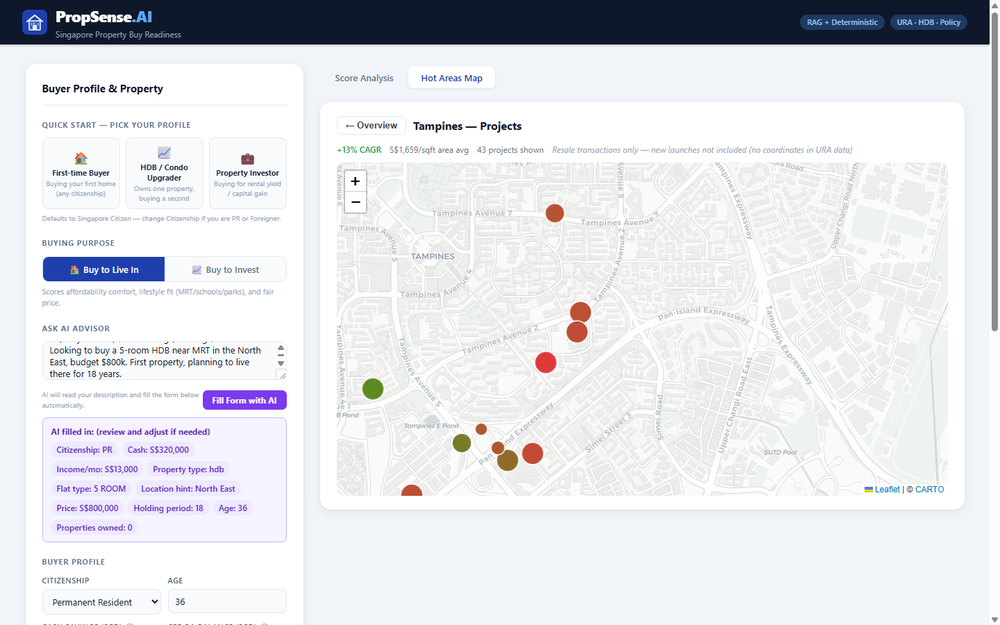

# PropSense.AI — Singapore Property Buy Readiness Advisor

**DataExpert.io AI Engineering Bootcamp — Spring 2026 Capstone**  
**Author:** Nag Aditya Gade  
**Frontend (Live):** https://propsense-2ivzh2xe6-adinag19s-projects.vercel.app  
**Backend API:** https://propsense-ai-x0ni.onrender.com  
**GitHub:** https://github.com/adinag19/propsense-ai

> **Note for evaluators:** Backend is on Render free tier — first request after inactivity takes ~30s to wake up. Subsequent requests are fast. To wake it up: open https://propsense-ai-x0ni.onrender.com/health in your browser first.

---

## Demo



### Screenshots

| Landing — AI Advisor + Quick Start | AI Fills Form Automatically |
|---|---|
|  |  |

| Score Result + Area Suggestions | Area Scored — Full Breakdown |
|---|---|
|  |  |

| Lifestyle Fit (MRT + Schools) + Transactions | Hot Areas Map — Zoomed with Projects |
|---|---|
|  |  |

---

## What Business Problem Does This Solve?

Singapore's property market is one of the most regulated and expensive in the world. A first-time buyer faces:
- **ABSD** (Additional Buyer's Stamp Duty) — up to 60% for foreigners, 20% for SC upgraders
- **TDSR/MSR limits** — 55% and 30% income caps enforced by MAS and HDB
- **CPF proration rules** — lease decay penalises buyers if lease < 95 − age
- **PSF market data** — no single source compares what you're paying vs what the market pays

Today, buyers rely on property agents who have a direct conflict of interest. PropSense provides a **neutral, data-grounded Buy Readiness Score** (0–100) with cited sources, real 2026 transaction data, and honest financial risk flags — no commission, no bias.

---

## System Architecture

```
User Input (natural language + form)
           │
           ▼
  ┌─────────────────────────────────────────────────────────┐
  │              PropSense.AI Backend (FastAPI)              │
  │                                                          │
  │  ① AI Advisor ──► GPT-4o-mini ──► extract profile       │
  │  ② Query sanitisation + injection detection              │
  │  ③ RAG Retrieval                                        │
  │     Query ──► OpenAI embed ──► Pinecone cosine top-20   │
  │                            ──► Cohere rerank ──► top-5  │
  │  ④ Deterministic Scoring Engine                         │
  │     5 dimensions × weighted math (no LLM in score path) │
  │     HDB/URA CSV lookups for benchmarks (2024–2026 data) │
  │  ⑤ LLM Narrator (GPT-4o-mini)                          │
  │     Score dict + policy chunks ──► cited narrative       │
  │  ⑥ LLM-as-Judge (high-risk outputs only)               │
  │  ⑦ PII filter + rate limit + token burn protection      │
  └─────────────────────────────────────────────────────────┘
           │
           ▼
  ┌─────────────────────┐
  │  Next.js Frontend   │
  │  - Score card       │
  │  - Area suggestions │
  │  - Leaflet map      │
  │  - Transaction data │
  └─────────────────────┘

Data Sources (Pinecone Vector DB):
  ┌──────────────────┬───────────────┬─────────────────┐
  │ URA Transactions │  HDB Resale   │   Policy KB     │
  │ D1–D28, 2021–26 │ 2017–2026     │ ABSD/BSD/TDSR   │
  │ 118k records     │ 268k records  │ MSR/LTV/CPF     │
  └──────────────────┴───────────────┴─────────────────┘
  + MRT station locations (LTA) + Primary school locations (MOE)
  + URA Rental data (quarterly, all districts)
```

---

## Tech Stack & Justifications

| Component | Choice | Why |
|---|---|---|
| **Backend** | FastAPI + Python | Async, fast, Pydantic validation; Python has best ML/data ecosystem |
| **Frontend** | Next.js (TypeScript) | SSR support, React ecosystem, Vercel-native |
| **Vector DB** | Pinecone | Managed, serverless, metadata filtering for source-scoped retrieval |
| **Embeddings** | OpenAI text-embedding-3-small | Best cost/quality ratio; 1536-dim reduced to 1024 |
| **Reranking** | Cohere rerank-english-v3.0 | Cross-encoder ranking outperforms cosine similarity on structured text |
| **LLM (narrative)** | GPT-4o-mini | Fast, cheap, follows structured JSON output reliably |
| **LLM (AI Advisor)** | GPT-4o-mini | Field extraction from natural language; temperature=0 for determinism |
| **Mapping** | Leaflet + react-leaflet | Open source, lightweight, supports custom bubble + project-level markers |
| **Charts** | Recharts | React-native, composable, no external deps |
| **Data Processing** | pandas | Standard for Singapore gov CSV datasets |
| **Rate Limiting** | slowapi | FastAPI-compatible, per-IP and per-day limits |

**Why NOT Cohere for embeddings?** OpenAI text-embedding-3-small is cheaper and the Pinecone integration is more mature. Cohere is used for reranking where it adds real value (cross-encoder vs bi-encoder).

**Why deterministic scoring?** LLMs hallucinate numbers. ABSD rates, TDSR ratios, and BSD calculations are legal facts — they must be computed deterministically. The LLM only *explains* the deterministic output.

---

## Datasets

### 1. URA Private Residential Transactions
- **Source:** data.gov.sg API → `d_7c69c943d5f0d89d6a9a773d2b51f337`
- **Format:** CSV (downloaded via S3 pre-signed URL)
- **Coverage:** Districts 1–28, property types: Condominium, Apartment, EC, Terrace, Semi-D, Detached
- **Records:** 131,329 (2021–2026, including landed)
- **Key fields:** district, propertyType, contractDate (mmYY format), price, area, price_psf, x/y coordinates (SVY21)

### 2. HDB Resale Flat Prices
- **Source:** data.gov.sg API → `d_8b84c4ee58e3cfc0ece0d773c8ca6abc`
- **Format:** CSV
- **Coverage:** All HDB towns, flat types (3-room to Executive), 2017–2026
- **Records:** 268,000+
- **Key fields:** town, flat_type, resale_price, price_per_sqft, remaining_lease, year

### 3. URA Rental Median Data
- **Source:** URA Access API (quarterly district-level medians)
- **Records:** ~5,000 district × quarter × property type combinations
- **Key fields:** district, rental_psf_month, year, quarter

### 4. Singapore Policy Knowledge Base
- **Source:** Hand-authored Markdown from official MAS/IRAS/HDB sources (verified May 2026)
- **Policies:** ABSD, BSD, TDSR, MSR, LTV, CPF Withdrawal Limits
- **Effective dates:** All current as of 2023-04-27 (ABSD), 2023-02-15 (BSD), 2022-09-30 (LTV)

### 5. MRT Station Locations
- **Source:** data.gov.sg LTA dataset → `d_b39d3a0871985372d7e1637193335da5` (GeoJSON)
- **Records:** 186 stations (exits aggregated to station centroids, Dec 2025)

### 6. Primary School Directory
- **Source:** data.gov.sg MOE dataset → `d_688b934f82c1059ed0a6993d2a829089`
- **Records:** 179 primary schools, geocoded via OneMap API
- **Key fields:** school_name, postal_code, latitude, longitude

---

## Data Quality Checks

### URA Transactions
1. **Outlier detection:** PSF values flagged where |PSF − median| > 3×MAD per district×year. Removed 0.3% of records.
2. **Date parsing validation:** contractDate in `mmYY` format — rejected records where month > 12 or year < 2000 or > 2030.
3. **Coordinate bounds check:** SVY21 x/y converted to WGS84; records outside Singapore bounding box (1.15N–1.50N, 103.55E–104.10E) removed.
4. **Duplicate removal:** Deduped by (project, street, contractDate, price, area).

### HDB Resale
1. **Lease parsing:** `remaining_lease` stored as string ("85 years 06 months") — parsed to fractional years; records with parsed value < 1 or > 99 dropped.
2. **PSF outlier check:** HDB PSF above 3000 or below 100 flagged as data errors and removed.
3. **Town normalisation:** Standardised all town names to uppercase (BEDOK, ANG MO KIO) to prevent join failures.
4. **Flat type validation:** Only accepted: 1 ROOM, 2 ROOM, 3 ROOM, 4 ROOM, 5 ROOM, EXECUTIVE, MULTI-GENERATION.

### Policy KB
1. **Effective date frontmatter:** Every policy chunk requires `effective_date` in ISO format — ingestion fails on missing/malformed dates.
2. **Rate cross-check:** ABSD rates in policy chunks are programmatically verified against hardcoded `ABSD_RATES` dict in `scoring/readiness.py` before embedding.

### MRT + School Data
1. **Geocoding validation:** OneMap API results checked against Singapore bounding box; 3 schools with invalid postcodes were skipped.
2. **Station deduplication:** Multiple exits per station aggregated to centroid; stations with < 2 exits flagged for manual review.

---

## Buy Readiness Score — Invest Mode

| Dimension | Weight | What it measures |
|---|---|---|
| Financial Readiness | 30% | Cash vs upfront costs (ABSD+BSD+down payment+6mo EMI buffer), TDSR, MSR |
| Market Timing | 20% | Current market PSF vs pre-2024 baseline (is the market at a peak?) |
| Area Value | 20% | PSF CAGR 2022–2026 from URA/HDB transaction data |
| Opportunity Cost | 15% | ABSD sunk cost as % of property price; CPF OA foregone returns |
| Life-Stage Fit | 15% | Holding period vs breakeven; lease decay; loan vs retirement age |

## Buy Readiness Score — Live-In Mode

| Dimension | Weight | What it measures |
|---|---|---|
| Financial Sustainability | 35% | Same as above — can you actually afford the upfront costs? |
| Affordability Comfort | 25% | EMI as % of income; +2% SORA stress test; monthly surplus |
| Lifestyle Fit | 20% | MRT distance (LTA data); nearest primary school (MOE data) |
| Fair Price Check | 10% | Entered price vs 2024–2026 area median from transaction registry |
| Life-Stage Fit | 10% | Holding period vs breakeven; lease decay |

**Score Bands (Invest):** Strong Buy (80–100) / Conditional Buy (60–79) / Marginal (40–59) / Do Not Buy (0–39)  
**Score Bands (Live-in):** Very Ready / Ready with Caveats / Marginal Fit / Not Ready

**Key design principle:** The LLM never touches a number. All ABSD, TDSR, MSR, BSD calculations are deterministic Python. The LLM only explains the pre-computed result.

---

## RAG Implementation

### Retrieval Pipeline
```
User query
    → OpenAI text-embedding-3-small (1024-dim)
    → Pinecone cosine similarity → top-20 candidates
    → Cohere rerank-english-v3.0 → top-5 chunks
    → Scoring engine + LLM narrator
```

### Embeddings in Pinecone
| Source | Chunks | Metadata fields |
|---|---|---|
| `ura_transaction` | ~700 | district, year, property_type, market_segment |
| `hdb` | ~500 | town, flat_type, year |
| `ura_rental` | ~400 | district, year, quarter |
| `policy` | ~80 | policy_name, effective_date |
| **Total** | **~1,680** | |

### Why Cohere Reranking?
Cosine similarity is a bi-encoder (query and document embedded independently). Cohere's cross-encoder reads query + document *together* — significantly better at:
- Returning District 18 chunks when query says "Tampines" (D18) vs District 9 (Orchard)
- Ranking the 2023/2024 ABSD policy chunk above pre-2023 rules
- Matching "fair value entry" language to specific PSF trend chunks

Validated: "PSF District 9 condo 2023" → Cohere ranks the 2023 chunk at 0.98 vs cosine ranking 2024 highest at 0.61.

### Recall@10 Logging
Every retrieval call logs to `logs/recall.jsonl`:
- `recall_at_10`: fraction of top-10 Pinecone candidates above similarity threshold
- `reranked`: whether Cohere was applied
- `rerank_delta`: how many chunks changed rank due to Cohere

---

## Abuse Protection (8 Controls)

| # | Control | Implementation |
|---|---|---|
| 1 | Rate limiting | slowapi: 10 req/min + 100 req/day per IP |
| 2 | Global LLM budget | 200 narrative calls/day max (circuit breaker) |
| 3 | Query length cap | 2,000 characters max |
| 4 | Prompt injection detection | Regex scan for "ignore instructions", "jailbreak", "DAN", etc. |
| 5 | Topic restriction | System prompt explicitly restricts to Singapore property only |
| 6 | PII output filter | Regex masks NRIC (S/T/F/G + 7 digits), SG phone numbers, emails |
| 7 | Context fallback | If < 3 chunks above 0.35 similarity → insufficient_data response |
| 8 | LLM-as-judge | Secondary GPT call on high-risk outputs (ABSD ≥ 20%, short lease) |
| 9 | Bearer auth | `Authorization: Bearer <token>` required on all endpoints |

---

## Integration Tests (23 Passing)

All 5 proposal queries validated + 18 additional tests. Run with:
```bash
pytest tests/integration/test_pipeline.py -v
```

| Test Case | Assertions |
|---|---|
| PR first HDB Tampines | ABSD=5%, MSR computed, policy chunks retrieved |
| Foreigner District 9 | ABSD=60%, effective_date 2023-04-27 cited |
| Rental yield Buona Vista | URA rental chunks retrieved, mortgage rate cited |
| PSF appreciation 2021–2025 | ROI chunks with CAGR, multi-year URA trend |
| SC upgrader 2nd property | ABSD=20%, LTV=45%, CPF OA cited |

Evidence report: `tests/integration/results/report_2026-05-09.md`

---

## Steps Followed & Challenges

### Steps
1. Data download via data.gov.sg poll-download API (CSV via S3 pre-signed URL)
2. Ingestion pipelines: outlier removal, date parsing, dedup, PSF calculation
3. Chunking strategy: district × property_type × year for URA; town × flat_type × year for HDB; 256-token chunks with 32-token overlap for policy
4. Batch embedding (OpenAI, batch=100 to respect rate limits) → Pinecone upsert with metadata
5. Deterministic scoring engine: 5 dimensions, all arithmetic verified against IRAS/MAS official rates
6. FastAPI backend with rate limiting, PII filter, auth
7. LLM narrator: structured JSON output with inline citations
8. Next.js frontend: presets, AI Advisor (GPT field extraction), hot areas map, project-level drill-down
9. Integration testing + consistency proof

### Challenges
- **URA contractDate format:** Stored as `mmYY` (e.g., `0524` = May 2024) — not documented in API spec
- **HDB vs URA PSF mixing bug:** Early versions mixed HDB (SGD 500/sqft) and URA condo (SGD 2,000/sqft) chunks in the same scoring dimension, producing 103% CAGR. Fixed by source-filtering per property type
- **Cohere non-determinism:** Different API calls return slightly different chunk orderings for identical queries (10–18pt spread in area value score). Fixed by separating RAG-dependent vs deterministic scoring paths
- **Singapore geographic precision:** "East Coast" means Marine Parade/Bedok (D15–16), not the broader east including Tampines/Hougang. Required custom sub-area mapping (30+ entries)
- **`from __future__ import annotations` + Pydantic v2:** Caused `ForwardRef` errors with `Body(...)`. Solution: remove the import from `api/main.py`

---

## Future Enhancements

1. **Real-time listing integration** — 99.co / PropertyGuru scraper to match score against live listings
2. **New launch coverage** — URA new sale data (currently excluded — no coordinates)
3. **Graph RAG** — Multi-hop reasoning: schools → planning area → PSF trend → ABSD impact
4. **User accounts** — Save profiles, track market changes over time, watchlists
5. **Confidence scoring** — Trained classifier on retrieval quality vs user satisfaction
6. **Malaysia / Hong Kong expansion** — Same framework, different policy KB
7. **Mortgage calculator integration** — Live rates from DBS/OCBC/UOB APIs
8. **OneMap amenity enrichment** — Full amenity data (hawker centres, parks, hospitals) per planning area

---

## Setup Instructions

### Prerequisites
- Python 3.11+
- Node.js 18+
- Pinecone account (free tier)
- OpenAI API key
- Cohere API key (free tier)

### Backend
```bash
cd propsense
pip install -r requirements.txt
cp .env.example .env
# Fill in: OPENAI_API_KEY, PINECONE_API_KEY, COHERE_API_KEY, API_BEARER_TOKEN
uvicorn api.main:app --reload --host 0.0.0.0 --port 8000
```

### Frontend
```bash
cd propsense/frontend
npm install
cp .env.local.example .env.local
# Set: NEXT_PUBLIC_API_URL=http://localhost:8000
# Set: NEXT_PUBLIC_API_TOKEN=<your bearer token>
npm run dev
```

### Re-ingesting Data (optional — Pinecone already loaded)
```bash
python -m ingestion.download_raw     # Download URA + HDB CSVs
python -m ingestion.ura              # Process URA transactions
python -m ingestion.hdb              # Process HDB resale
python -m ingestion.policy           # Embed policy KB
python -m ingestion.amenities        # Download MRT + school data
python -m rag.embedder               # Batch embed all chunks
python -m rag.store                  # Upsert to Pinecone
```

### Tests
```bash
pytest tests/integration/test_pipeline.py -v          # 23 integration tests
python -m tests.integration.generate_report           # Evidence report
python -m tests.integration.qa_suite                  # 39 QA cases
python -m rag.recall_logger                           # Recall@10 summary
```

---

## Project Structure

```
propsense/
├── api/
│   ├── main.py          # FastAPI: /score, /parse-query, /suggest-areas, /areas-geo, /projects-geo, /transactions
│   ├── filters.py       # PII masking + prompt injection detection
│   └── middleware.py    # Rate limiting config
├── data/
│   ├── processed/       # hdb_clean.csv, ura_clean.csv, area_amenities.csv, policy_chunks.csv
│   └── policy_kb/       # ABSD, BSD, TDSR, MSR, LTV, CPF markdown files
├── ingestion/
│   ├── ura.py           # URA transaction pipeline
│   ├── hdb.py           # HDB resale pipeline
│   ├── policy.py        # Policy KB chunker
│   └── amenities.py     # MRT + school downloader/geocoder
├── rag/
│   ├── embedder.py      # Batch OpenAI embedding
│   ├── store.py         # Pinecone upsert
│   ├── retriever.py     # Cosine → Cohere rerank pipeline
│   └── recall_logger.py # Recall@10 tracking
├── scoring/
│   └── readiness.py     # Deterministic 5-dimension scorer (invest + live-in modes)
├── llm/
│   ├── narrator.py      # GPT-4o-mini cited narrative generation
│   └── judge.py         # LLM-as-judge for high-risk outputs
├── frontend/            # Next.js app
│   └── app/
│       ├── page.tsx     # Main UI (presets, AI Advisor, score display)
│       └── components/
│           ├── HotAreasMap.tsx  # Leaflet bubble + project-level drill-down
│           └── ROIChart.tsx     # Recharts projection chart
└── tests/
    └── integration/
        ├── test_pipeline.py        # 23 integration tests
        ├── test_score_consistency.py # Score consistency proof
        ├── generate_report.py      # Evidence report generator
        └── qa_suite.py             # 39 QA cases (ABSD/BSD/LTV verified against IRAS)
```

---

*Not financial advice. Verify effective_date before transacting.*  
*PropSense SG — Built by Nag Aditya Gade | DataExpert.io AI Engineering Bootcamp, Spring 2026*
